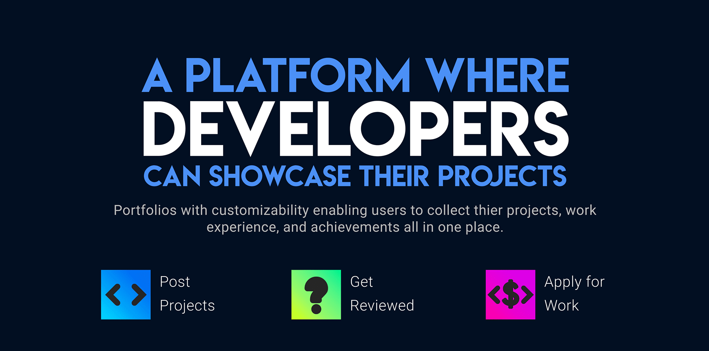

<p align="center">
    <strong><h1>BRYTE .... A New Way To Market Developers</h1></strong>
</p>



# 🎇 Story

Bryte is a platform intended for the
Software Engineering community,
making developers able to brand
themselves easily. We help them to
gather all the work in one place. Not just
the code, documentation, or the
technical view of the project but also the
marketing and branding aspects.
Alongside projects, their account will be a
customized portfolio to include all their
technical skills, participation, and
working experience so that you don't
have to create your portfolio from
scratch and update every time you get a
new skill. For organizations, their account
will include the projects they made and
teams working on it. We also allow them
to announce projects they need
developers to work on. And through each
developer's account, the evaluation
criteria have never been easier.

Feel free to create a pull request, add any issues or suggestions.
------------------------------------------------------------------

💻 Video
--------

https://drive.google.com/file/d/1qF_khR2zRM17Y_D8MbwiO7uRQo52R1-n/view?usp=sharing
----------------------------------------------------------------------------------

💻 Built Using
--------------

* MYSQL
* EJS
* Nodejs
* Express
* HTML

To Run The Code, Install
------------------------

```
NodeJS
```

Redirect to the app directory
-----------------------------

```
cd app
```

Then, install used packages
---------------------------

```
npm install
```

Create Environment variables
----------------------------

```
touch .env
```

And fill the variables
----------------------

```
DB_PORT=3306
PORT=3000
DB_HOST=localhot
DB_USER=root //most common user name
DB_PASSWARD=//your database password for connection
MYSQL_DB=//database name
```

Now, App Is Running! Write This Line In The Search Field Of Your Browser To start browsing
------------------------------------------------------------------------------------------

```
localhost:3000/home
```
